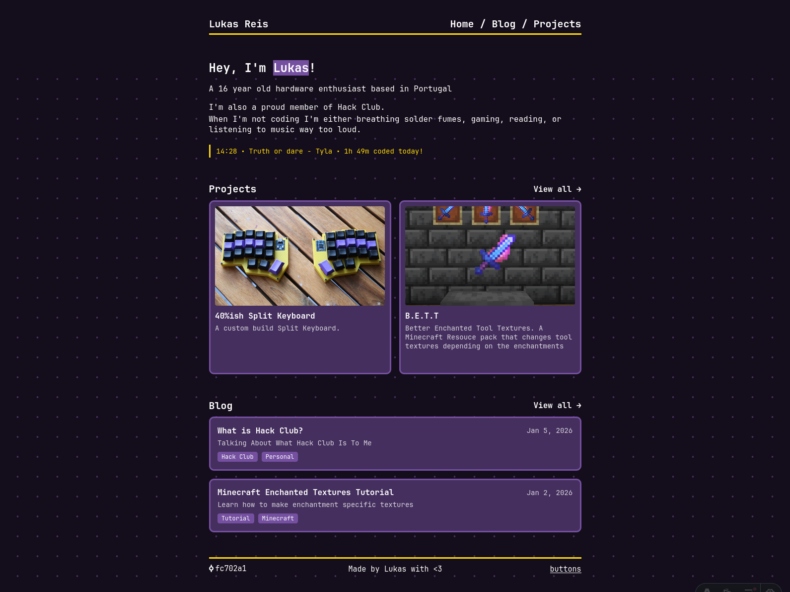

# lukasreis.com

My personal website built with [Astro](https://astro.build), featuring blog and project pages.

**Live site:** [lukasreis.com](https://lukasreis.com)

---



---

## Tech Stack

- [Astro](https://astro.build) ~ static site framework
- [MDX](https://mdxjs.com/) ~ blog content
- [Cloudflare Pages](https://pages.cloudflare.com/) ~ hosting & deployment

## Features

- Blog with MDX support
- Projects showcase
- RSS feed
- Custom 404 page

## Project Structure

```
src/
├── components/   # Reusable UI components
├── content/      # Blog posts & content collections
├── data/         # Static data
├── layouts/      # Page layouts
├── pages/        # Routes & pages
├── styles/       # Global styles
└── utils/        # Utility functions
```

## Run Locally

```bash
npm install
npm run dev
```

## Other Commands

| Command           | Action                        |
| :---------------- | :---------------------------- |
| `npm run build`   | Build for production          |
| `npm run preview` | Preview production build      |

## Deployment

The site is deployed to [Cloudflare Pages](https://pages.cloudflare.com/).